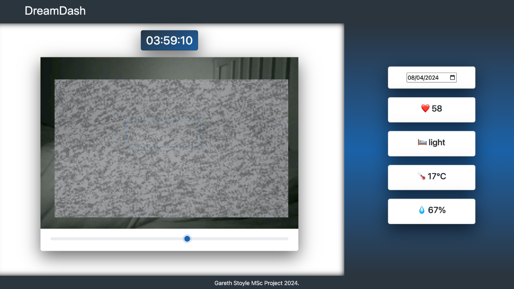

# DreamDash
A sleep tracking system which synchronises FitBit data with motion detected recorded footage and a DHT11 environmental sensor.

Motion detection (via opencv) would result in only a portion of the night of sleep being saved to save on memory/processing.

The end user can then drag through the motion detected footage, seeing their data as the night goes on.

## Setup
Create virtual environment:

`python -m venv .venv`

(If you have opencv installed already on the pi, add `--system-site-packages` to the virtual environment and remove the opencv packages from requirements.txt, pip installing opencv may take a long time!)

Install requirements:

`pip install -r requirements.txt`

Install MP4Box:

`sudo apt-get install -y gpac`

## Run
### Run unit tests
`make test`

### Initiate recording
`make record`

### Launch Flask dashboard
`make dashboard`